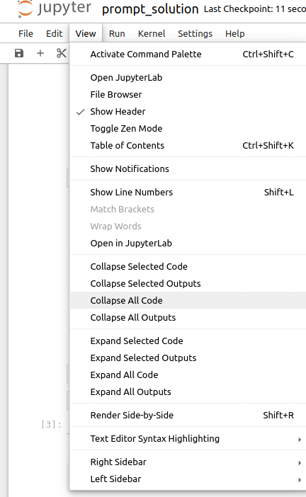
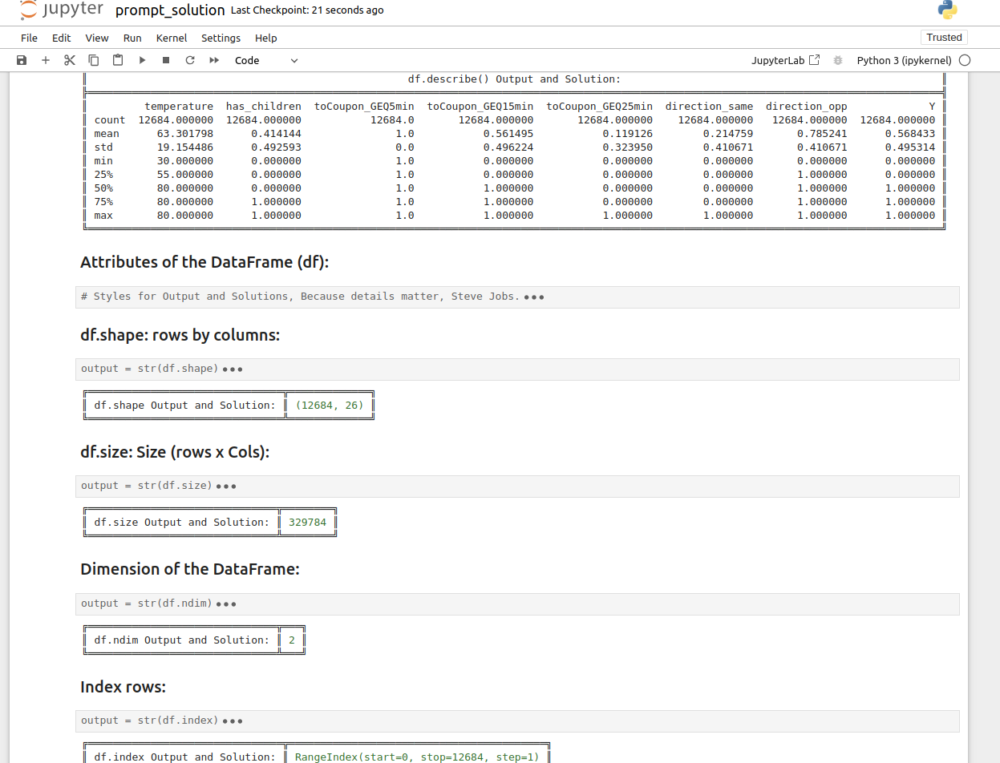
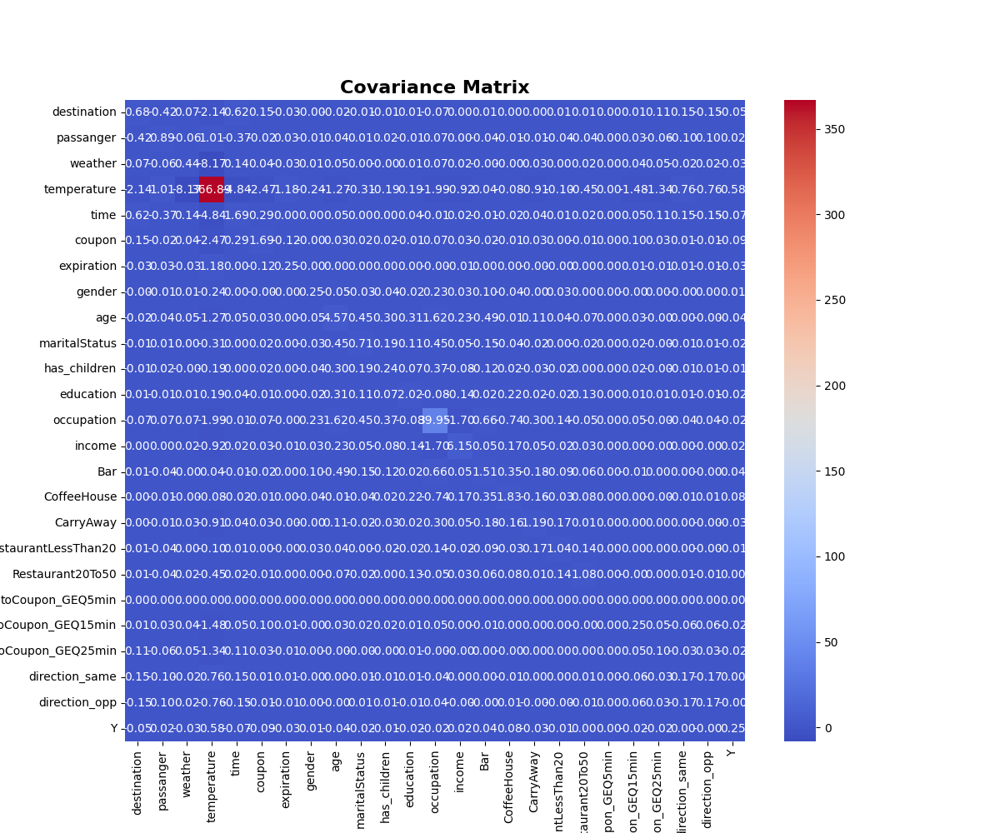

# Practical Application Assignment 5.1:


### Overview:
In this first practical application assignment of the program, you will seek to answer the question, “Will a customer accept the coupon?” The goal of this project is to use what you know about visualizations and probability distributions to distinguish between customers who accepted a driving coupon versus those that did not. Use the Practical Application 1 Jupyter Notebook Links to an external site.to complete this assignment.

### Data:
This data comes to us from the UCI Machine Learning repository and was collected via a survey on Amazon Mechanical Turk. The survey describes different driving scenarios, including the destination, current time, weather, passenger, etc., and then asks people whether they will accept the coupon if they are the driver. Answers given that the users will drive there “right away” or “later before the coupon expires” are labeled as “Y = 1”, and answers “no, I do not want the coupon” are labeled as “Y = 0”. There are five different types of coupons—less expensive restaurants (under $20), coffee houses, carry out and take away, bars, and more expensive restaurants ($20–$50).

### Deliverables:
Your final product should be a brief report that highlights the differences between customers who did and did not accept the coupons. To explore the data, you will utilize your knowledge of plotting, statistical summaries, and visualization using Python. You will publish your findings in a public facing GitHub repository as your first portfolio piece.

##  General Objectives

Learning outcomes achieved by this module's learning activities:
- Navigate files and directories using your terminal
- Create, alter, and delete files using your terminal
- Create .git repositories locally in your terminal
- Create GitHub repositories online
- Connect local .git repositories to GitHub
- Use the add, commit, push commands to update work in a remote repository
- Apply exploratory data analysis, plotting, statistical summarization, and data visualization skills and techniques to a machine learning problem.

**so we have:**

# Will the Customer Accept the Coupon?

## Description

The goal of this project is to use what you know about visualizations and probability distributions to distinguish between customers who accepted a driving coupon versus those that did not.

---
**Then, First:**

## Installation

Follow these steps to clone the repository and run it in Jupyter Notebook:

1. **Clone the repository**

   Open a terminal and clone the repository using Git:

   ```bash
   git clone https://github.com/gitcoffee/coupons
   ```

   Navigate to the project directory:

   ```bash
   cd nombre-del-repositorio
   ```

2. **Create a virtual environment (optional, but recommended)**

   Create a virtual environment to manage the project's dependencies:

   ```bash
   python -m venv env
   ```

   Activate the virtual environment:

   - On **Windows**:

     ```bash
     .\env\Scripts\activate
     ```

   - On **macOS/Linux**:

     ```bash
     source env/bin/activate
     ```

3. **Install dependencies**

   Install the required dependencies using `pip`:

   ```bash
   pip install -r requirements.txt
   ```

4. **Install Jupyter Notebook (if not installed)**

   If you don't have Jupyter Notebook installed, install it with:

   ```bash
   pip install notebook
   ```

## Running in Jupyter Notebook

1. **Start Jupyter Notebook**

   Launch Jupyter Notebook from the terminal:

   ```bash
   jupyter notebook
   ```

   This will open Jupyter in your web browser.

2. **Open the notebook**

   In the Jupyter Notebook interface, navigate to the project folder and open the `.ipynb` file you want to run.

3. **Run the notebook**

   Execute the notebook cells by clicking the **Run** button or using the `Shift + Enter` keyboard shortcut.

## If you want to see only the outputs, you can configure Jupyter like this: (Optional)

To collapse all the code:



And the result is:



---

**Now you will find the solutions and outputs to the questions posed, as well as:**
# Summary of Findings and Link to Notebook

### Based on the observations obtained, several hypotheses can be proposed about drivers who accepted bar coupons. The following hypotheses are detailed based on the different segments of analyzed data:

1. **Frequency of Bar Visits and Age**:
    - Drivers who never go to the bar or go less than once a month and are 21 years old or younger tend to accept coupons at a rate of 59.4%.
    - Drivers who go to the bar between 1 and 8 times a month or more, and are 26 years old or older, tend to accept coupons at a rate of 62.15%.

    **Hypothesis**: Younger drivers who do not frequent bars have a lower coupon acceptance rate compared to older drivers who visit bars more regularly.

2. **Frequency of Bar Visits, Companions, and Occupation**:
    - Drivers who go to the bar between 1 and 8 times a month or more, are accompanied by friends, a partner, or alone, and have occupations other than farming, fishing, or forestry, accept coupons at a rate of 62.31%.

    **Hypothesis**: The coupon acceptance rate is higher among drivers who frequent bars and do not have occupations related to agriculture, fishing, or forestry.

3. **Frequency of Bar Visits, Companions, and Marital Status**:
    - Drivers who go to the bar between 1 and 8 times a month or more, are accompanied by friends, a partner, or alone, and are not widowed, accept coupons at a rate of 62.31%.

    **Hypothesis**: The marital status of drivers (excluding widowed individuals) does not seem to have a significant impact on coupon acceptance among those who frequent bars.

4. **Frequency of Bar Visits and Age (Different Group)**:
    - Drivers who go to the bar between 1 and 8 times a month or more, and are 21, 26, or under 21 years old, accept coupons at a rate of 62.81%.

    **Hypothesis**: Younger drivers (up to 26 years old) who frequent bars tend to accept coupons at a higher rate compared to the general young segment.

5. **Frequency of Restaurant Visits and Income Level**:
    - Drivers who visit restaurants between 4 and 8 times a month or more, and have an annual income between $12,500 and $49,999, accept coupons at a rate of 60.07%.

    **Hypothesis**: Drivers with moderate to low incomes who frequently visit restaurants also show a higher tendency to accept coupons.

---
### General Hypothesis $\(H_0\)$

The acceptance of bar coupons seems to be influenced by several factors, such as the frequency of bar visits, age, companions, occupation, marital status, and income level. Overall, it is observed that:

- Drivers who frequent bars (1-8 times a month or more) tend to accept coupons at higher rates.
- Younger drivers who do not frequent bars have a lower acceptance rate compared to older drivers who do.
- Occupations unrelated to agriculture, fishing, or forestry, and the absence of widowhood do not significantly affect the acceptance rate among drivers who frequent bars.
- Drivers with moderate to low incomes who frequently visit restaurants also show a higher tendency to accept coupons.

These hypotheses can serve as a basis for marketing strategies aimed at increasing the coupon acceptance rate among different segments of drivers.

### Findings, Next steps and recommendations

#### **This covariance matrix can help understand the interdependencies between variables in the dataset and identify patterns that may be important for further analysis or predictive modeling.**

The result is:



#### Conclusions from the Covariance Matrix:

The covariance matrix shows the relationships between variables in the dataset. Here are some key points:

1. **Strong Negative Covariances**:
   - `temperature` with many variables (`destination`, `weather`, `Bar`), indicating that as the temperature increases, these variables tend to decrease and vice versa.
   
2. **Strong Positive Covariances**:
   - `destination` and `time` (0.622): Destinations and time have a positive relationship, suggesting that certain combinations of destinations and time are more common together.
   - `coupon` and `destination` (0.150): There is a positive relationship between coupons and destinations.

3. **Notable Relationships**:
   - `age` and `maritalStatus` (0.447): Age has a positive relationship with marital status.
   - `education` and `occupation` (0.133): Education has a positive relationship with occupation.
   - `toCoupon_GEQ25min` and `direction_same` (0.111): There is a small positive relationship between the time to the coupon and the same direction.

---
## Repository Link

You can find the detailed to summary of findings and link to notebook in the [prompt_solution.ipynb](prompt_solution.ipynb) file.

---
## Contribution

If you want to contribute to the project, (Note: Only the professor):

## License

This project is licensed under the MIT License - see the [LICENSE](LICENSE) file for details.


